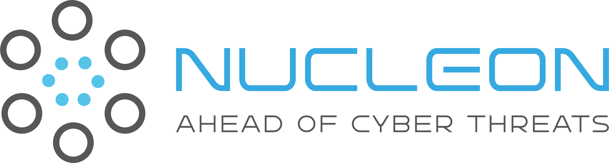
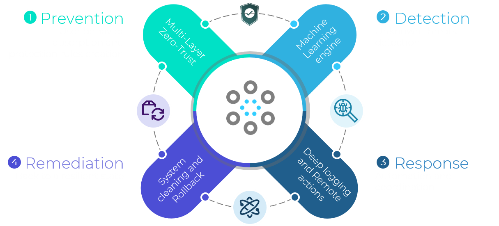
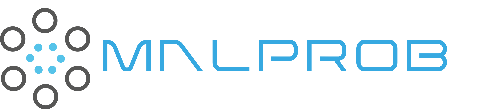

# Nucleon security's vision

  

Nucleon Security is a cybersecurity solutions editor. Its main product is Nucleon EDR (Endpoint Detection and Response), which is a next-generation antivirus based on AI and modern cybersecurity paradigms such as Zero Trust. The ultimate goal is to offer a new generation of business-centric cybersecurity solutions that enhance companies' resilience to cyber threats.

# Nucleon EDR

  

Nucleon EDR is a next-generation endpoint security solution powered by multilayer Zero Trust paradigm and AI. It has four main features :

- **Prevention:** By being the first EDR to implement the Zero Trust paradigm.
- **Detection:** Using AI for malware detection based on file static analysis.
- **Response:** Offering a console where the administrator has full control and a clear vision of the network of endpoints.
- **Remediation:** This EDR is resilient; even if an attack takes place, it offers the possibility to restore what is infected.

# Nucleon Malprob

  

Nucleon Malprob is an AI-as-a-service solution dedicated to malware detection. It supports various file types, including PE, ELF, Mach-O, JARs, script files, PDFs, Office documents, and more. Also it can extract IoCs from the files and provide a detailed report about the file. 

[Product link](https://malprob.io/)

# Public Repositories
### [Nucleon Watcher](https://github.com/nucleonsecurity/nucleon-watcher)
Nucleon watcher is a File detection and response tool that helps you to find malicious files inside a specific directory. Using Nucleon malprob API, Nucleon watcher scans the files and returns the result to the user. Nucleon watcher is a command line tool that can be used in different platform.

### [Tech-Talks](https://github.com/nucleonsecurity/tech-talks)
Tech-talks is a series of webinars hosted by Nucleon Security. To share its knowledge and expertise in the field of cybersecurity, software egineering ,data engineering , AI and more/. This repository serves as a centralized hub for all resources related to Nucleon-security webinars. It includes webinar recordings, presentation slides, documentation, Q&A sessions, and additional materials from past and future webinars.

# The team
Nucleon Security is a team of cybersecurity engineers, data scientists, data and software engineers. It was founded by Anass CHANAA and Antoine BOTTE .

